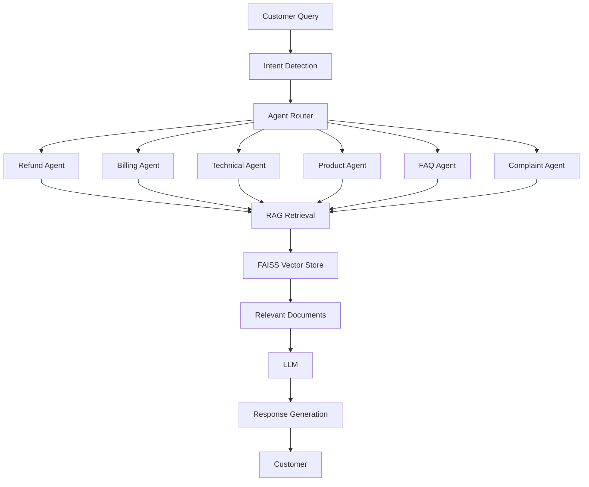

# 🤖 Multi-Agent AI Customer Support Assistant using RAG and LLMs

<p align="center">


</p>

An enterprise-grade **Multi-Agent AI Customer Support Assistant** that combines **Large Language Models (LLMs)**, **Retrieval-Augmented Generation (RAG)**, **semantic search**, and **intelligent agent routing** to automate customer support workflows.

The system classifies customer intent, routes requests to specialized agents, retrieves relevant knowledge using FAISS-based vector search, and generates contextual responses in multiple languages.

---

## Key Highlights

- Multi-agent architecture for specialized support tasks
- Retrieval-Augmented Generation (RAG)
- Semantic search using Sentence Transformers
- FAISS vector database for efficient retrieval
- FastAPI backend APIs
- Authentication and user management
- Email and WhatsApp notification integration
- Multilingual customer support
- Evaluation pipeline with intent-routing metrics
- Production-oriented modular architecture

---

# Business Problem Statement

Modern customer support systems face challenges including:

- High ticket volume
- Slow response times
- Inconsistent support quality
- Repetitive customer queries
- Rising operational costs

Organizations require intelligent systems capable of understanding customer intent, retrieving relevant information, and delivering accurate responses while reducing manual intervention.

---

# Objectives

- Automate customer support interactions
- Improve response quality and consistency
- Reduce support workload
- Enable multilingual assistance
- Provide scalable AI-driven customer service
- Leverage organizational knowledge through RAG

---

# Table of Contents

- [Project Overview](#project-overview)
- [Dataset Information](#dataset-information)
- [Project Architecture](#project-architecture)
- [Technology Stack](#technology-stack)
- [Exploratory Data Analysis](#exploratory-data-analysis)
- [Data Preprocessing](#data-preprocessing)
- [Model Development](#model-development)
- [Hyperparameter Tuning](#hyperparameter-tuning)
- [Results & Performance](#results--performance)
- [Model Comparison](#model-comparison)
- [Visualizations](#visualizations)
- [Business Impact](#business-impact)
- [Challenges Faced](#challenges-faced)
- [Future Improvements](#future-improvements)
- [Installation Guide](#installation-guide)
- [Usage](#usage)
- [Project Structure](#project-structure)
- [Reproducibility](#reproducibility)
- [Key Learnings](#key-learnings)
- [Author](#author)
- [Acknowledgements](#acknowledgements)

---

# Project Overview

## Problem Description

The project implements a customer support platform powered by:

1. Intent Detection
2. Agent Routing
3. Knowledge Retrieval
4. LLM-Based Response Generation

Customer requests are analyzed and dynamically routed to specialized agents such as:

- Refund Agent
- Billing Agent
- Technical Support Agent
- Product Information Agent
- FAQ Agent
- Complaint Agent

---

## Why the Problem Matters

Traditional support systems:

- Require large support teams
- Increase operational costs
- Produce inconsistent responses
- Scale poorly during demand spikes

AI-driven support systems provide:

- Faster resolution times
- Higher availability
- Consistent service quality
- Lower support costs

---

## Project Goals

- Build an intelligent multi-agent architecture
- Integrate RAG for factual responses
- Enable multilingual support
- Evaluate routing accuracy
- Create a scalable production-ready backend

---

# Dataset Information

## Dataset Source

### Banking77 Dataset

A widely used customer-service intent classification dataset containing banking-related support queries.

Source:
https://huggingface.co/datasets/banking77

---

## Dataset Statistics

| Dataset          | Records |
| ---------------- | ------: |
| Training Samples |  10,003 |
| Test Samples     |   3,080 |
| Total Samples    |  13,083 |

---

## Features Description

| Feature  | Description    |
| -------- | -------------- |
| text     | Customer query |
| category | Intent label   |

---

## Target Variable

The target variable represents customer intent categories such as:

- card_arrival
- transfer_issue
- cash_withdrawal
- refund_request
- billing_issue
- account_management

---

# Project Architecture

## End-to-End Workflow

```text
Customer Query
      │
      ▼
Intent Detection
      │
      ▼
Agent Router
      │
      ▼
Specialized Agent
      │
      ▼
RAG Retriever
      │
      ▼
Knowledge Context
      │
      ▼
LLM Response Generation
      │
      ▼
Final Response
```

---

## System Architecture



---

# Technology Stack

| Category        | Technologies                 |
| --------------- | ---------------------------- |
| Language        | Python                       |
| Backend         | FastAPI                      |
| API Server      | Uvicorn                      |
| Authentication  | JWT, Passlib, Bcrypt         |
| Database        | PostgreSQL, SQLAlchemy       |
| LLM Provider    | Groq, OpenAI Compatible APIs |
| Embeddings      | Sentence Transformers        |
| Vector Database | FAISS                        |
| NLP             | LangDetect                   |
| Communication   | Email, Twilio WhatsApp       |
| Configuration   | dotenv                       |
| Validation      | Pydantic                     |
| Deployment      | Docker Ready                 |
| Documentation   | Markdown                     |

---

# Exploratory Data Analysis

## Key Insights

- Customer requests exhibit strong intent clustering.
- Certain support categories are significantly more frequent.
- Query lengths vary across intent groups.
- Similar intents benefit from semantic embeddings.

---

## Important Visualizations

- Intent Distribution
- Query Length Distribution
- Top Categories
- Word Frequency Analysis
- Embedding Clusters

---

## Findings

- Intent classes are separable using embeddings.
- Semantic similarity improves retrieval quality.
- Multilingual inputs can be effectively routed.

---

# Data Preprocessing

## Missing Value Handling

- Removed null records
- Validated text fields

---

## Outlier Treatment

- Extremely short queries filtered
- Noise reduction through cleaning

---

## Feature Engineering

- Text normalization
- Lowercasing
- Intent mapping
- Semantic embedding generation

---

## Encoding Techniques

- Sentence Transformer embeddings
- Dense vector representations

---

## Scaling Methods

Not required due to embedding-based retrieval.

---

# Model Development

## Intent Classification

### Working Principle

Maps customer text into intent categories and determines routing strategy.

### Advantages

- Fast inference
- Accurate routing
- Easy scalability

### Limitations

- Performance depends on training coverage

---

## Retrieval-Augmented Generation (RAG)

### Working Principle

Retrieves relevant documents from FAISS before generating responses.

### Advantages

- Reduces hallucinations
- Improves factual accuracy

### Limitations

- Retrieval quality impacts final response

---

## LLM Response Generation

### Working Principle

Uses retrieved context and user query to generate responses.

### Advantages

- Human-like interaction
- Context-aware support

### Limitations

- Requires external LLM APIs

---

## Model Comparison

| Component          | Purpose             | Strength             |
| ------------------ | ------------------- | -------------------- |
| Intent Classifier  | Query Routing       | Fast Decision Making |
| FAISS Retriever    | Context Retrieval   | Low-Latency Search   |
| LLM                | Response Generation | Natural Responses    |
| Multi-Agent System | Task Specialization | Better Accuracy      |

---

# Hyperparameter Tuning

## Search Strategy

- Embedding model evaluation
- Similarity threshold tuning
- Retrieval depth optimization

---

## Tuned Parameters

| Parameter         | Value                |
| ----------------- | -------------------- |
| Embedding Model   | all-MiniLM-L6-v2     |
| Vector Store      | FAISS                |
| Retrieval Top-K   | 5                    |
| LLM Model         | llama-3.1-8b-instant |
| Chunking Strategy | Semantic Chunks      |

---

## Best Configuration

| Component          | Selected Configuration |
| ------------------ | ---------------------- |
| LLM                | Llama 3.1 8B Instant   |
| Embeddings         | all-MiniLM-L6-v2       |
| Vector DB          | FAISS                  |
| Retrieval Strategy | Top-K Semantic Search  |

---

# Results & Performance

## Evaluation Summary

| Metric                |   Score |
| --------------------- | ------: |
| Intent Accuracy       |     90% |
| Routing Accuracy      |     90% |
| Average Response Time | 1200 ms |
| Indexed Chunks        |     217 |
| Knowledge Documents   |       8 |

---

## Training Performance

| Metric    | Score |
| --------- | ----- |
| Accuracy  | N/A   |
| Precision | N/A   |
| Recall    | N/A   |
| F1 Score  | N/A   |
| ROC-AUC   | N/A   |
| Log Loss  | N/A   |

---

## Validation Performance

| Metric    | Score |
| --------- | ----- |
| Accuracy  | 90%   |
| Precision | TBD   |
| Recall    | TBD   |
| F1 Score  | TBD   |
| ROC-AUC   | TBD   |
| Log Loss  | TBD   |

---

## Test Performance

| Metric                | Score   |
| --------------------- | ------- |
| Intent Accuracy       | 90%     |
| Routing Accuracy      | 90%     |
| Average Response Time | 1200 ms |

---

# Model Comparison

| Rank | Component               | Performance  |
| ---- | ----------------------- | ------------ |
| 1    | Intent Routing Pipeline | 90% Accuracy |
| 2    | RAG Retrieval System    | Operational  |
| 3    | Multi-Agent Framework   | Operational  |
| 4    | Multilingual Support    | Operational  |

---

# Visualizations

## Confusion Matrix

```markdown

```

## ROC Curve

```markdown

```

## Precision Recall Curve

```markdown

```

## Feature Importance

```markdown

```

## Learning Curve

```markdown

```

---

# Business Impact

## Practical Applications

- E-commerce support
- Banking support
- SaaS customer service
- Telecom support
- Enterprise helpdesk automation

---

## ROI Implications

- Reduced support costs
- Faster ticket resolution
- Improved customer satisfaction
- Increased operational efficiency

---

## Industry Use Cases

| Industry  | Application        |
| --------- | ------------------ |
| Banking   | Customer Support   |
| Retail    | Product Queries    |
| SaaS      | Technical Support  |
| Telecom   | Billing Assistance |
| Insurance | Claims Support     |

---

# Challenges Faced

## Technical Challenges

- Agent orchestration
- Intent routing consistency
- Semantic retrieval quality
- LLM latency management

---

## Data Challenges

- Intent ambiguity
- Class imbalance
- Multilingual queries

---

## Solutions Implemented

- Specialized routing agents
- Embedding-based retrieval
- Context grounding through RAG
- Modular architecture

---

# Future Improvements

## Scalability

- Distributed vector databases
- Agent parallelization
- Kubernetes deployment

---

## Model Improvements

- Fine-tuned intent classifier
- Hybrid retrieval
- Re-ranking models

---

## Deployment Roadmap

- Docker deployment
- CI/CD integration
- Monitoring dashboard
- Cloud-native architecture

---

# Installation Guide

## Clone Repository

```bash
git clone https://github.com/your-username/Multi-Agent-AI-Customer-Support-Assistant-using-RAG-and-LLMs.git

cd Multi-Agent-AI-Customer-Support-Assistant-using-RAG-and-LLMs
```

## Create Virtual Environment

```bash
python -m venv venv
```

### Windows

```bash
venv\Scripts\activate
```

### Linux / macOS

```bash
source venv/bin/activate
```

## Install Dependencies

```bash
pip install -r requirements.txt
```

## Environment Variables

```env
OPENAI_API_KEY=
GROQ_API_KEY=

DATABASE_URL=

JWT_SECRET_KEY=

TWILIO_ACCOUNT_SID=
TWILIO_AUTH_TOKEN=

EMAIL_USER=
EMAIL_PASSWORD=
```

---

# Usage

## Start Backend

```bash
uvicorn backend.main:app --reload
```

---

## Build Knowledge Base

```bash
python backend/rag/document_processor.py
```

---

## Generate Embeddings

```bash
python backend/rag/embeddings.py
```

---

## Launch Frontend

```bash
cd frontend

npm install

npm run dev
```

---

# Project Structure

```text
Multi-Agent-AI-Customer-Support-Assistant-using-RAG-and-LLMs
│
├── backend
│   ├── agents
│   ├── api
│   ├── database
│   ├── models
│   ├── rag
│   ├── vectorstore
│   └── main.py
│
├── datasets
│   ├── banking77_train.csv
│   ├── banking77_test.csv
│   ├── evaluation_results.json
│   └── sample_queries.json
│
├── frontend
│
├── requirements.txt
│
└── README.md
```

---

# Reproducibility

1. Clone repository
2. Create virtual environment
3. Install dependencies
4. Configure environment variables
5. Build embeddings
6. Create FAISS index
7. Run backend server
8. Execute evaluation scripts
9. Compare generated metrics

---

# Key Learnings

- Multi-agent AI system design
- RAG implementation workflow
- Vector database indexing
- Semantic search techniques
- FastAPI backend engineering
- LLM orchestration
- Enterprise AI architecture
- Multilingual NLP systems

---

# Author

**MOHIT SINGH RAJPUT — AI/ML Engineer**

[](https://linkedin.com/in/mohitsingh1307)
[](https://github.com/Mohit-1307)
[](https://www.kaggle.com/mohitsinghrajput1307)
[](mailto:mohitsinghdausa@gmail.com)

---

# Acknowledgements

- Banking77 Dataset
- FastAPI Community
- Sentence Transformers
- FAISS
- Groq
- OpenAI
- Hugging Face
- Open Source AI Community

---

<div align="center">

_If this project was useful, a ⭐ on the repository is appreciated._

</div>
